  

# 🚀 Awesome Model Serving Platform & AI Inference Ecosystem

  
  
  
  

A curated list of **SaaS Products**, **Cloud Managed Services**, and **Open-Source GitHub Projects** for **Model Serving**, **LLM Inference**, **GPU Optimization**, and **Kubernetes AI Deployment**.

> 💡 **Market Insight & Industry Overview (2026):**  
> The dedicated **Model Serving & AI Inference Platform Market** is estimated at **$2.9 Billion – $3.06 Billion in 2026**, growing at a CAGR of ~43.3% toward 2030.  
> 📊 **Market Structure:** The sector is **moderately to highly fragmented**. While tech giants (AWS, Google Cloud, NVIDIA) dominate enterprise cloud infrastructure, specialized serverless platforms (Modal, Replicate, Baseten) and open-source engines (vLLM, Ollama, Triton, KServe) capture high developer mindshare, preventing a single "winner-take-all" outcome.

---

## 📌 Table of Contents

- [☁️ SaaS & Hosted Platforms](#%EF%B8%8F-saas--hosted-platforms)
- [🔓 Open-Source GitHub Projects](#-open-source-github-projects)
- [🤝 How to Contribute](#-how-to-contribute)
- [☕ Support & Sponsorship](#-support--sponsorship)
- [📈 Star History](#-star-history)
- [⚠️ Disclaimer](#%EF%B8%8F-disclaimer)

---

## ☁️ SaaS & Hosted Platforms

The table below compares leading commercial and managed model serving platforms, sorted by **Company Size (Market Cap / Valuation / Estimated Valuation)** in descending order:

| 🏢 SaaS / Managed Platform | 📊 Company Size (Valuation / Market Cap / Revenue) | 💳 Starting Paid Tier Pricing | 🎁 Free Tier / Trial Limits | 📝 Description |
| :--- | :--- | :--- | :--- | :--- |
| **[Amazon SageMaker Endpoints](https://aws.amazon.com/sagemaker/)** | **~$2.10 Trillion** (Parent: Amazon / AWS ~$105B revenue) | **$0.05/hour** (e.g., `ml.t3.medium` instance) | **AWS Free Tier**: 250 hours/month of `ml.t3.medium` inference for the first 2 months | Fully managed model hosting and inference service within the AWS cloud ecosystem with autoscaling and multi-model endpoints. |
| **[Vertex AI Prediction](https://cloud.google.com/vertex-ai)** | **~$2.05 Trillion** (Parent: Alphabet / GCP ~$43B revenue) | **$0.045/hour** (e.g., `n1-standard-2` node) | **$300 free trial credits** valid for 90 days across Google Cloud services | Cloud-native prediction and online/batch inference service integrated inside Google Cloud Vertex AI. |
| **[NVIDIA NIM / NGC Endpoints](https://www.nvidia.com/)** | **~$2.00 Trillion** (NVIDIA Market Cap) | **$4,500/GPU/year** (NVIDIA AI Enterprise license) | **90-day free trial** via NVIDIA Developer Program with 1,000 free API call credits | Optimized inference microservices and hosted endpoints delivering maximum throughput for AI models on NVIDIA GPUs. |
| **[Hugging Face Inference Endpoints](https://huggingface.co/inference-endpoints)** | **~$4.5 Billion** (Valuation) | **$0.06/hour** (CPU instance) / **$0.60/hour** (GPU instance) | **$9/month HF PRO plan** includes $9 in compute credits; pay-as-you-go free sign-up | Managed dedicated endpoints for instantly deploying models from the Hugging Face Hub with 1-click autoscaling. |
| **[Anyscale](https://www.anyscale.com/)** | **~$1.0 Billion** (Valuation) | **$0.15/Anyscale Credit Unit (ACU)** (~$0.60/hr/GPU) | **$50 free compute credits** upon registration | Managed Ray platform providing production Ray Serve deployments, distributed inference, and autoscaling. |
| **[Modal](https://modal.com/)** | **~$500 Million** (Valuation) | **$0.000008/sec** (~$0.03/hr CPU) / **$0.00016/sec** (~$0.59/hr GPU) | **$30/month recurring free compute credits** on Starter tier | Serverless cloud platform optimized for running and scaling ML inference and compute-intensive Python workloads with instant cold starts. |
| **[Replicate](https://replicate.com/)** | **~$350 Million** (Valuation) | **$0.000225/sec** (CPU) / **$0.000575/sec** (Nvidia T4 GPU) | **$5 free trial credits** upon GitHub account verification | Serverless model hosting platform enabling developers to run open-source and custom models via simple HTTP API endpoints. |
| **[RunPod](https://www.runpod.io/)** | **~$250 Million** (Estimated Valuation) | **$0.20/hour** (Secure Cloud GPU instance) / **$0.00007/sec** (Serverless) | **$5 starting credit promo** for new user sign-ups | Developer-friendly GPU cloud platform popular for deploying serverless inference endpoints and pod clusters with flexible pricing. |
| **[Baseten](https://www.baseten.co/)** | **~$200 Million** (Valuation) | **$0.00008/sec** (~$0.30/hr CPU) / **$0.00021/sec** (~$0.75/hr GPU) | **$30 free credits** upon sign-up for workspace onboarding | High-performance model deployment platform focused on fast iteration, custom runtimes (Truss), and production generative AI serving. |
| **[Seldon Core Cloud / Enterprise](https://www.seldon.io/)** | **~$100 Million** (Estimated Valuation) | **$1,000/month** (Enterprise cluster starter license) | **14-day free enterprise cloud trial** with standard Kubernetes sandbox | Enterprise-grade managed offering of Seldon Core for governed, explainable model serving, drift detection, and inference graphs. |
| **[TrueFoundry](https://www.truefoundry.com/)** | **~$50 Million** (Valuation) | **$500/month** (Growth tier platform fee + infrastructure costs) | **14-day free trial** with $50 infrastructure credits included | Multi-cloud ML and LLM deployment platform offering internal developer portal capabilities on top of Kubernetes clusters. |
| **[Beam Cloud](https://www.beam.cloud/)** | **~$25 Million** (Estimated Valuation) | **$0.000009/sec** (~$0.03/hr CPU) / **$0.00019/sec** (~$0.70/hr GPU) | **$10 free monthly credits** on community tier | Serverless cloud infrastructure designed for building, deploying, and scaling Python ML APIs and background jobs. |
| **[BentoML Cloud](https://www.bentoml.com/)** | **~$8.8 Million** (Acquired by Modular / Est. Revenue ~$583K) | **$0.00005/sec** (~$0.18/hr CPU) / **$0.00024/sec** (~$0.85/hr GPU) | **$10 free compute credits** upon account setup | Fully managed deployment platform tailored for the open-source BentoML framework for packaging and scaling AI services. |

---

## 🔓 Open-Source GitHub Projects

Model serving benefits from an exceptionally strong open-source foundation. Below is a comprehensive list of top open-source model serving frameworks and inference engines, sorted by **GitHub Star Count** in descending order:

| 🏆 Rank | ⭐ Repository & Star Badge | 📝 Description |
| :---: | :--- | :--- |
| 1 |  **[Ollama](https://github.com/ollama/ollama)** | Lightweight, cross-platform framework to get up and running with Llama 3, Mistral, Gemma, and other LLMs locally or on server endpoints. |
| 2 |  **[vLLM](https://github.com/vllm-project/vllm)** | High-throughput and memory-efficient LLM serving engine powered by PagedAttention, compatible with OpenAI API standards. |
| 3 |  **[LocalAI](https://github.com/mudler/LocalAI)** | Free, open-source OpenAI-compatible REST API drop-in replacement for local inference without GPU requirements. |
| 4 |  **[Ray Serve](https://github.com/ray-project/ray)** | Scalable Python-first model serving library built on Ray, ideal for composing complex multi-model pipelines and microservices. |
| 5 |  **[SGLang](https://github.com/sgl-project/sglang)** | Fast execution engine and programming system for complex LLM applications, featuring RadixAttention for fast prefix caching. |
| 6 |  **[TensorRT-LLM](https://github.com/NVIDIA/TensorRT-LLM)** | NVIDIA's open-source library for compiling and optimizing LLM inference performance specifically for NVIDIA GPUs. |
| 7 |  **[Triton Inference Server](https://github.com/triton-inference-server/server)** | High-performance enterprise inference server supporting TensorRT, PyTorch, TensorFlow, ONNX, dynamic batching, and concurrent model execution. |
| 8 |  **[BentoML](https://github.com/bentoml/BentoML)** | Open-source framework for packaging ML models into standardized containers (Bentos) with easy cloud and Kubernetes deployment. |
| 9 |  **[LMDeploy](https://github.com/InternLM/lmdeploy)** | Toolkit for compressing, deploying, and serving Large Language Models (LLMs) with high performance and low latency. |
| 10 |  **[TensorFlow Serving](https://github.com/tensorflow/serving)** | Flexible, high-performance serving system for machine learning models designed for production environments and gRPC endpoints. |
| 11 |  **[KServe](https://github.com/kserve/kserve)** | CNCF Kubernetes-native model serving platform providing standardized `InferenceService` CRDs, scale-to-zero autoscaling, and multi-runtime support. |
| 12 |  **[Seldon Core](https://github.com/SeldonIO/seldon-core)** | Open-source Kubernetes operator for deploying ML models with advanced routing (A/B testing, shadow deployments), explainers, and metrics. |
| 13 |  **[TorchServe](https://github.com/pytorch/serve)** | Production-ready PyTorch model serving framework developed co-jointly by AWS and PyTorch (Linux Foundation). |
| 14 |  **[LitServe](https://github.com/Lightning-AI/litserve)** | Flexible, ultra-fast Python AI serving engine built on FastAPI by Lightning AI, optimized for custom ML model pipelines. |
| 15 |  **[MLServer](https://github.com/SeldonIO/MLServer)** | Python-based core inference engine implementing the V2 Data Plane / Open Inference Protocol, standardizing runtimes for KServe and Seldon. |
| 16 |  **[Open Inference Protocol](https://github.com/kserve/open-inference-protocol)** | Open REST and gRPC API specification for standardized model serving dataplane interactions across AI runtimes. |

### 🛠️ Architectural Recommendations & Ecosystem Map

- **☸️ Kubernetes-Native Infrastructure:** Standardize on **[KServe](https://github.com/kserve/kserve)** or **[Seldon Core](https://github.com/SeldonIO/seldon-core)** for autoscaling, canary rollouts, and multi-tenant cluster management.
- **⚡ LLM High-Throughput Inference:** Pair **[vLLM](https://github.com/vllm-project/vllm)** or **[SGLang](https://github.com/sgl-project/sglang)** with **[Triton Inference Server](https://github.com/triton-inference-server/server)** or **[BentoML](https://github.com/bentoml/BentoML)** for chunked prefill, prefix caching, and batch optimization.
- **🚀 Hardware Acceleration:** Utilize **[TensorRT-LLM](https://github.com/NVIDIA/TensorRT-LLM)** on NVIDIA GPUs for maximum tokens/sec throughput.
- **💻 Local & Edge Deployment:** Use **[Ollama](https://github.com/ollama/ollama)** or **[LocalAI](https://github.com/mudler/LocalAI)** for offline or desktop-based OpenAI API emulation.

---

## 🤝 How to Contribute

1. Fork the repository.
2. Add or update entries in `README.md` adhering to the table format.
3. Ensure pricing, valuation, and GitHub star links are accurate and updated.
4. Submit a Pull Request with a short summary of changes.

---

## ☕ Support & Sponsorship

Thank you for exploring and utilizing the **Awesome Model Serving Platform** list! If this repository helped you evaluate, choose, or deploy model serving infrastructure for your projects:

- ⭐ **Star this repository** to help others discover it.
- 🔀 **Fork & Share** it with fellow ML engineers, infrastructure architects, and teams.
- 💖 **Buy Me a Coffee**: If you'd like to support ongoing updates and open-source contributions, consider sponsoring via the [GitHub Sponsor Dashboard](https://github.com/sponsors/ishandutta2007)!

---

## 📈 Star History

---

## ⚠️ Disclaimer

- This list is community-curated for informational purposes and does not constitute financial or architectural advice.
- Model serving platforms handle production inferencing, which requires security controls, authentication, and compliance monitoring.

---

  <b>Maintained with ❤️ by the ML Community • Keeping Model Inference Fast, Scalable, and Open.</b>

